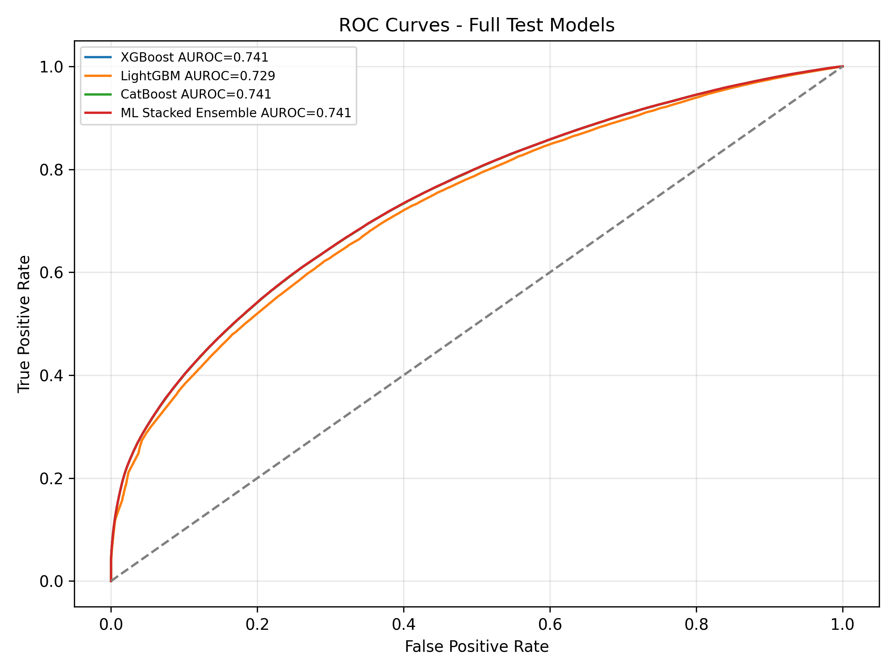
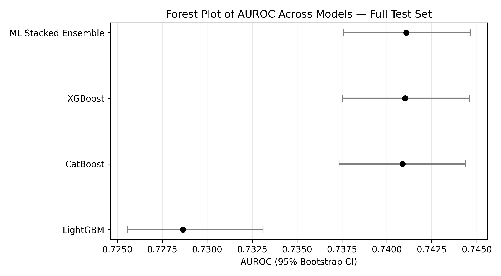
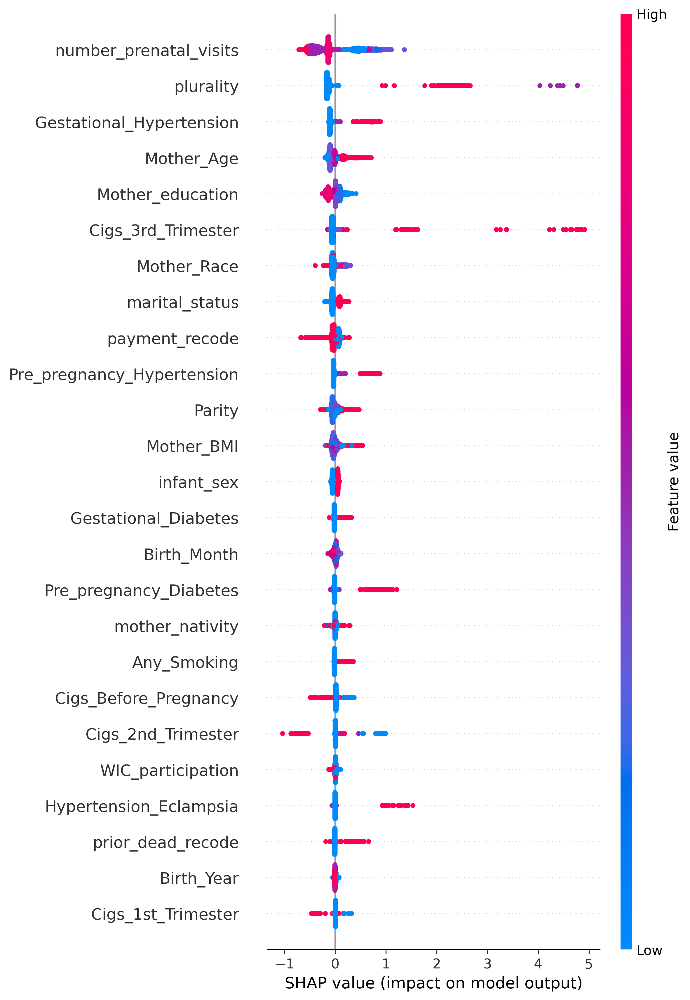
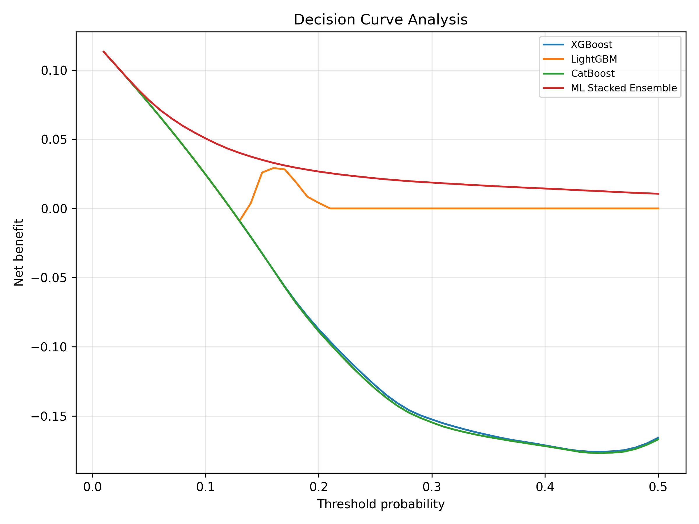

# Preterm Birth Prediction — Hybrid Tabular ML + Tabular-to-Image CNN

Predicting preterm birth (< 37 weeks gestation) from U.S. CDC/NCHS Natality
birth-certificate data (2021–2023, ~16M records) using a hybrid pipeline that
combines gradient-boosted tabular models with CNNs trained on tabular-to-image
feature maps, evaluated on a fully independent 1.63M-sample test set.

[]()
[]()

> **Best model:** ML Stacked Ensemble (XGBoost + LightGBM + CatBoost, meta-learner
> Logistic Regression) — **AUROC = 0.7411** (95% CI [0.7376, 0.7446]) on 1,629,378
> held-out test samples never seen during training.

---

## 1. Problem & Motivation

Preterm birth is a leading cause of neonatal morbidity/mortality, and early
antenatal risk stratification from routinely collected birth-certificate variables
(no imaging, no labs) is a practical, low-cost screening signal. This project asks:
*how far can standard, auditable ML models push AUROC on this task at population
scale, and does a tabular-to-image CNN branch add anything on top?*

## 2. Results

### 2.1 Full test set (1,629,378 samples, independent — not used for training)

| Model | AUROC | 95% CI | AUPRC | F1 | Sensitivity | Specificity |
|---|---|---|---|---|---|---|
| **ML Stacked Ensemble** ⭐ | **0.7411** | [0.7376, 0.7446] | 0.3915 | 0.3501 | 0.6085 | 0.7402 |
| XGBoost | 0.7410 | [0.7376, 0.7445] | 0.3916 | 0.3496 | 0.6107 | 0.7381 |
| CatBoost | 0.7409 | [0.7374, 0.7443] | 0.3908 | 0.3488 | 0.6129 | 0.7355 |
| LightGBM | 0.7286 | [0.7257, 0.7322] | 0.3615 | 0.3345 | 0.6211 | 0.7091 |



### 2.2 CNN branches (tabular-to-image, 120K-sample test subset — GPU/time-capped)

| Model | Feature map | AUROC | AUPRC | F1 |
|---|---|---|---|---|
| CNN EfficientNetB0-Fingerprint | 3-channel fingerprint map | 0.7307 | 0.3756 | 0.3341 |
| CNN ResNet18-DeepInsight | 1-channel DeepInsight map | 0.7296 | 0.3745 | 0.3358 |
| CNN Simple-UMAP | 1-channel UMAP-density map | 0.6383 | 0.2172 | 0.2683 |

Full per-model metrics (incl. MCC, PPV, NPV, Brier score, confusion-matrix counts)
are in [`final_scopus_metrics.csv`](results/preterm_scopus_publication_outputs/final_scopus_metrics.csv)
and the consolidated table in
[`consolidated_metrics_for_manuscript.csv`](results/preterm_scopus_publication_outputs/extra_publication_assets/consolidated_metrics_for_manuscript.csv).

**Takeaway:** the CNN feature-map branches do not beat well-tuned gradient boosting
on this tabular problem — expected, since birth-certificate variables are low-
dimensional/tabular by nature. They are included as an ablation / hybrid-architecture
comparison, not because they win.

### 2.3 Model comparison across all metrics



### 2.4 Top predictive features (SHAP, full-test XGBoost)

Number of prenatal visits and plurality (multiple birth) are the top two drivers,
followed by gestational hypertension, mother's age, and third-trimester smoking.



### 2.5 Clinical utility



### 2.6 Comparison with prior work on the same data source

| Study | Data | Best model | AUROC (preterm) |
|---|---|---|---|
| Koivu & Sairanen (2020), *PMC7096343* | CDC Natality (~16M) + NYC external test | Ensemble (LR + ANN + GBM) | 0.64 |
| Anand (2025), *arXiv:2507.21330* | CDC WONDER Natality 2017–2023 (643K) | MLP / XGBoost | 0.727–0.729 |
| **This project** | CDC Natality 2021–2023, 1.63M-sample independent test | ML Stacked Ensemble + CNN hybrid | **0.7411** |

> ⚠️ These are *reference points*, not a controlled head-to-head benchmark — the
> studies use different cohorts, years, and preprocessing. Treat this table as
> context, not proof of superiority.

More figures (calibration curves, CNN ROC curves, radar chart, confusion matrices,
SHAP dependence plots, feature correlation heatmap, sensitivity/specificity vs.
threshold, predicted probability distribution, Table 1 baseline characteristics) are
in [`results/preterm_scopus_publication_outputs/`](results/preterm_scopus_publication_outputs/)
and [`.../extra_publication_assets/`](results/preterm_scopus_publication_outputs/extra_publication_assets/),
and a full auto-generated write-up is in
[`paper_summary_report_scopus.md`](results/preterm_scopus_publication_outputs/paper_summary_report_scopus.md).

---

## 3. Repository Structure

```
.
├── notebooks/                                   # Runnable Jupyter notebooks (Kaggle-ready, full output committed)
│   ├── part_a_main_pipeline.ipynb               # Data → preprocessing → ML + CNN training → metrics
│   ├── part_b_extra_publication_assets.ipynb    # Table 1, forest plot, SHAP, DCA, calibration table
│   └── part_c_display_export.ipynb              # Inline figure gallery + transformed dataset export
├── results/
│   └── preterm_scopus_publication_outputs/      # Real artifacts from the Kaggle run reported above
│       ├── final_scopus_metrics.csv
│       ├── paper_summary_report_scopus.md
│       ├── roc_curves_full_test.png, calibration_full_test.png, decision_curve_analysis.png, ...
│       └── extra_publication_assets/            # Table 1, forest plot, SHAP dependence plots, radar chart, ...
├── docs/
│   ├── methodology.md                           # Pipeline details (English)
├── requirements.txt
├── LICENSE
└── README.md
```

`part_a` → `part_b` → `part_c` are meant to run **in that order, in the same
kernel/session** (B and C reuse variables — model objects, `X_train`/`X_test`,
`OUT_DIR` — created by A). They were split from a single working notebook so each
stage is independently readable; see [`docs/methodology.md`](docs/methodology.md)
for exactly what each stage does. All three notebooks in this repo are committed
**with their real output already embedded** (including all inline figures in
Part C) — you can read the results directly on GitHub without re-running anything.

---

## 4. Methodology (summary)

1. **Data**: [`poojamaheria/natality-2021-to-2023-v2`](https://www.kaggle.com/datasets/poojamaheria/natality-2021-to-2023-v2)
   on Kaggle — U.S. CDC/NCHS birth-certificate microdata, 2021–2023.
2. **Label**: `preterm = 1` if `category_gestation == 1` (< 37 weeks), else 0.
   Preterm prevalence ≈ 12.2%.
3. **Leakage removal**: all variables that are only known *after* delivery
   (birth weight, APGAR, NICU admission, delivery method, gestational-age-derived
   fields, etc. — 19 columns) are dropped before modeling. See the leakage-removal
   cell in [`notebooks/part_a_main_pipeline.ipynb`](notebooks/part_a_main_pipeline.ipynb).
4. **Split**: stratified 70% train / 15% val / 15% test, fixed seed (42).
5. **Tabular models**: XGBoost, LightGBM, CatBoost (class-weighted for the 12%
   positive rate), stacked via a logistic-regression meta-learner trained on
   out-of-fold validation predictions.
6. **Tabular-to-image CNN branch**: three feature-map encodings
   (DeepInsight-style, 3-channel "fingerprint", UMAP-density highlight) feed
   ResNet18 / EfficientNetB0 CNNs trained with AMP on a GPU-time-capped subset.
7. **Evaluation**: AUROC/AUPRC with bootstrap 95% CIs, Youden-optimal threshold,
   sensitivity/specificity/PPV/NPV, MCC, Brier score, calibration curves +
   Hosmer-Lemeshow, decision curve analysis, SHAP, and subgroup AUROC
   (by smoking status, BMI, plurality).

Full detail: [`docs/methodology.md`](docs/methodology.md) (English) 

## 5. How to Run

This pipeline is written for **Kaggle Notebooks with a T4 GPU** (it auto-downloads
the dataset via the Kaggle API and expects `/kaggle/working` paths, falling back to
`./` locally). To reproduce:

1. Open [`notebooks/part_a_main_pipeline.ipynb`](notebooks/part_a_main_pipeline.ipynb)
   on Kaggle (GPU T4 accelerator, Internet **on**), or download it and run it locally
   in Jupyter Lab with a Kaggle API token configured (`~/.kaggle/kaggle.json`) and a
   CUDA GPU.
2. Run it top to bottom — it installs missing packages, downloads the dataset,
   trains all 7 models, and saves metrics/figures to `OUT_DIR`.
3. In the **same session**, run `part_b_extra_publication_assets` for the extra
   publication-style assets (Table 1, forest plot, SHAP dependence plots, DCA).
4. Then `part_c_display_export` to view every generated figure inline and export
   the fully preprocessed train/val/test splits to CSV/Parquet.

```bash
pip install -r requirements.txt
```

⚠️ Full run trains on up to ~11.4M training rows and needs a CUDA GPU (T4-class or
better) and Internet access for the first Kaggle dataset download; a full run took
on the order of tens of minutes on Kaggle's T4. CPU-only execution works but will be
significantly slower for the boosting models and impractical for the CNN branch.

## 6. Requirements

See [`requirements.txt`](requirements.txt). Core stack: `xgboost`, `lightgbm`,
`catboost`, `torch` (+ `torchvision`), `shap`, `umap-learn`, `scikit-learn`,
`scipy`, `pandas`, `numpy`, `matplotlib`.

## 7. Limitations

- **AUROC ≈ 0.74 is a screening-level, not diagnostic-level, signal.** Positive
  predictive value at the operating threshold is ~25% given the 12% base rate —
  useful for triage/risk stratification, not a standalone clinical decision tool.
- Trained and tested on the **same U.S. national dataset**; no external-cohort
  validation was performed in this run (Koivu & Sairanen 2020 test against an
  external NYC cohort — see comparison table above for context).
- CNN branches were evaluated on a **capped 120K test subset**, not the full
  1.63M-sample test set, for GPU time reasons — not directly comparable
  sample-for-sample to the tabular models' full-test numbers.
- This is a research/portfolio project, **not a validated clinical tool**, and is
  not intended for direct clinical decision-making.
- Data-derived artifacts in `results/` are aggregate metrics and figures only, not
  raw data. The underlying CDC/NCHS Natality data is public-use but distributed via
  a third-party Kaggle dataset — review its terms before redistributing raw files.


